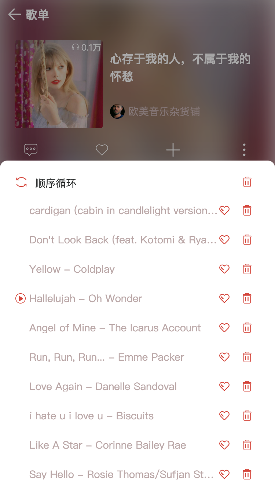

# React-Cloud-Music 仿网易云音乐 WebApp

> 参考 `https://github.com/sanyuan0704/react-cloud-music`，升级为 TypeScript 版本

- 技术栈: typescript、react、react hooks、unstated-next、immer、styled-components ...
- [预览地址](http://cloudmusic.frontendgo.com)
- [组件文档地址](http://cloudmusic.frontendgo.com/storybook)

## 启动项目

- 可在 `public/APP-CONFIG.js` 中配置 `API_ROOT`，指定接口地址

```bash
# 下载 client 依赖
cd react-cloud-music
yarn

# 下载 api 依赖
git submodule update --init --recursive
cd NeteaseCloudMusicApi
yarn
cd ..

# 启动
yarn api:dev
yarn client:start
```

---

## 部署

```bash
# 修改 public/APP-CONFIG.js API_ROOT 为 '/api' (通过 Nginx 代理到真实接口地址)

# 编译 client
yarn client:build
yarn client:storybook:build

# 启动 server
yarn server:prod:start
yarn api:prod:start

# 配置 Nginx (详见 nginx.conf)
```

---

## Npm Scripts

```bash
# client node server
yarn server:dev:{start}
yarn server:prod:{start,stop,restart,status}

# api server
yarn api:dev:{start}
yarn api:prod:{start,stop,restart,status}

# react app {启动,编译,测试,依赖分析}
yarn client:{start,build,test,report}

# 组件文档 storybook
yarn client:storybook:{start,build}

# 代码生成器 (创建一个{通用组件,页面,布局,容器})
yarn new:client:{component,page,layout,container}

# git commit
yarn git:commit
```

---

## 项目目录结构

<details>
<summary>展开查看</summary>
<pre><code>
├── assets           图片字体等资源
│
├── components       公用组件
│
├── config           配置
│
├── constants        常量
│
├── containers       状态容器
│
├── events           事件 (通常用于 view 和 services/tools 的解耦)
│
├── layouts          布局
│
├── pages            页面
│
├── routes           路由
│
├── services         数据层 (网络数据/本地存储数据/mock 数据)
│
├── styles           样式
│
├── tools            工具
│
├── typings          类型定义
│
├── App.tsx          根组件
│
└── index.tsx        入口
</code></pre>
</details>

---

## 其他

### VsCode

#### 扩展

- EditorConfig
- Prettier
- ESLint
- vscode-styled-components

### StoryBook 组件文档

```bash
# init
npx -p @storybook/cli sb init
```

### Hygen 代码生成器

```bash
# init
npm i -g hygen
cd project
hygen init self
hygen generator new component # 创建 component 命令
```

---

<p>
  
  
  
  
  
  
  
  
  
  
</p>
